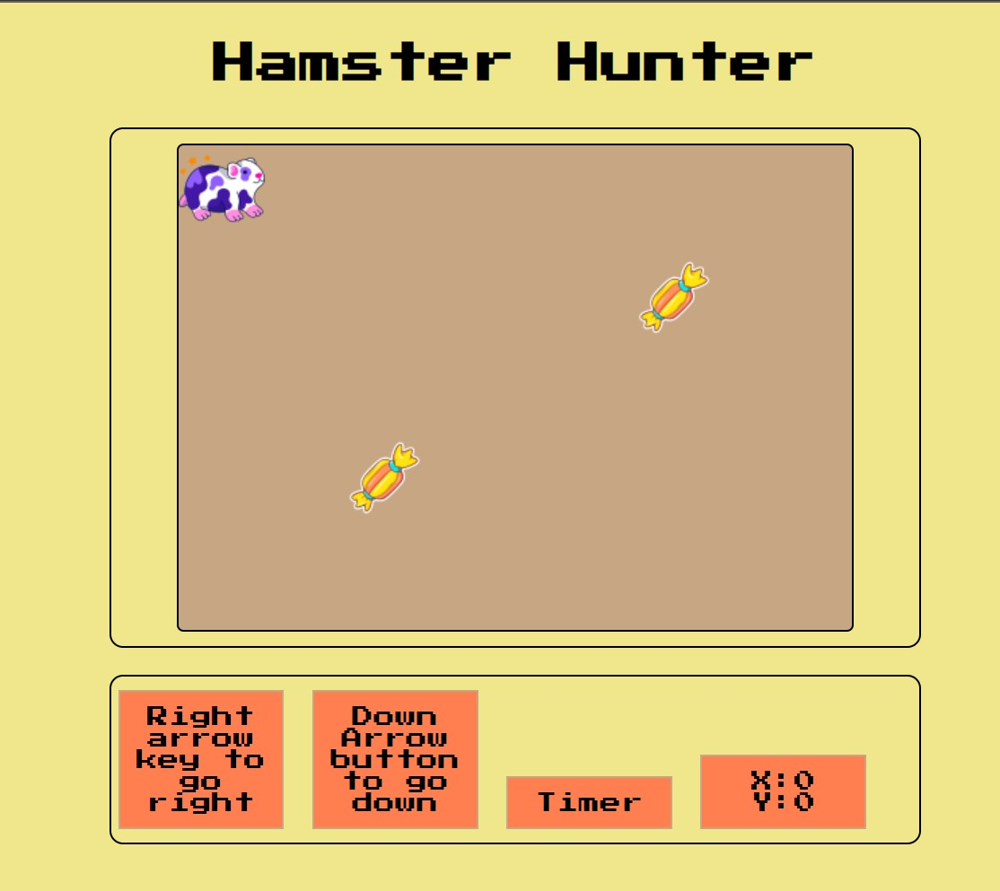
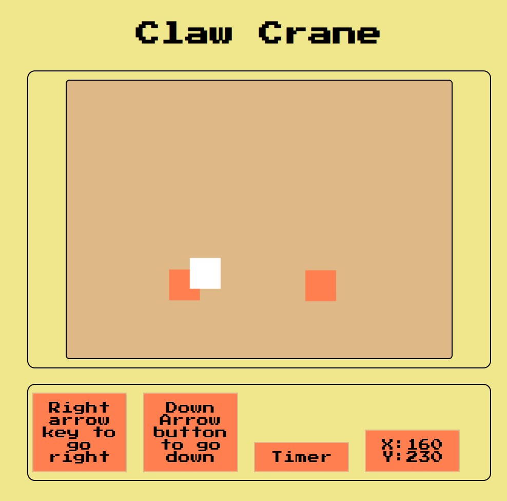

# Hamster hunter : An arcade game

## About the game

This is a variation of the claw crane, claw machine, toy crane or skill crane, which is a type of arcade game known as a merchandiser, commonly found in video arcades, supermarkets, restaurants, movie theaters, shopping malls, and bowling alleys.

## How it is played

* Move the hamster horizontally then vertically to get to the location of candy.
* Hamster will move when "Arrow right" key is pressed and will stop on release.
* Hamster will only move twice, once horizontally and again once vertically (or vice versa).
* Player can choose which direction they want to go first.
* You can have n number of turns. Tries will be labeled as tokens.
* You will have to move the hamster before timer ends.
* Every time player successfuly grabs a candy, player can earn more turns/tokens.
* Game ends when player runs out of turns/tokens.

## Tech Specs

The game will be created using HTML5 canvas, Javascript. DOM events will handle the user input. User input could be a keyboard press or mouse click on the button. Collision will happen not on the edges of 2 elements (hamster and candy) but on the center point the elements. This is a design choice to increase difficulty of the game. 

Turns/tokens will be handled by a class. End of turn will be triggered when timer runs out. The setinterval function will be used for this.

The location of the target element(candy) will be coming from a randomizer function, it will also be assigned a random value which can be added to the players turn/token. 

## Game layout

## MVP

* Create a canvas as play area.
* Create a button to start game.
* Create a timer for each turn.
* Randomly place candy on the canvas.
* Create event listeners for keypress.
* Count number of turns/tokens. Add or subtract based on result of last turn.
* Candy will have random exchange values to be traded for turns/tokens. 

## Development Progress

### Completed

* Function to move claw along x and y axis complete.
* Function includes forcing user to move along the x axis first before the y axis.
* Hamster will stop moving along the x axis when right arrow button is released 
* Hamster will stop moving along the y axis when down arrow button is released 
* Candy positions are placed at random location in the play area.
* Replaced prizes to candy and replaced claw with hamster as. Used drawImage on canvas instead of fillRect

### To Do

* HTML layout and design.
* Create class to hold number of tokens.
* Function to start game. This should also work after every turn.
* Function to reset game.
* Function to subtract tokens after every turn.
* Function to add tokens if player successfuly grabs a toy.

### Credit goes here

Hamster stickers created by Stickers - Flaticon
 

Chocolate stickers created by Gohsantosadrive - Flaticon
