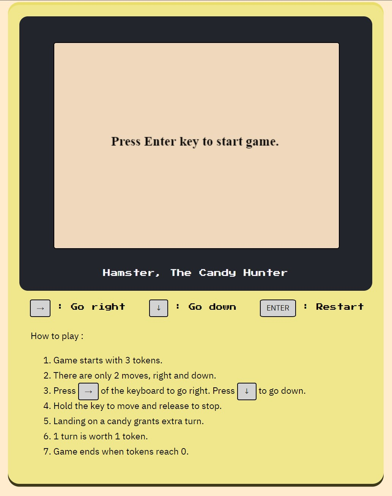

# Hamster,  The Candy Hunter : An arcade game

## About the game

This is a variation of the claw crane, claw machine, toy crane or skill crane, which is a type of arcade game known as a merchandiser, commonly found in video arcades, supermarkets, restaurants, movie theaters, shopping malls, and bowling alleys.

## How it is played

* Move the hamster horizontally then vertically to get to the location of candy.
* Hamster will move when "Arrow right" or "Arrow down" key is pressed and will stop on release.
* Hamster will only move twice, once horizontally and again once vertically (or vice versa).
* Player can choose which direction they want to go first.
* The player will start with 3 turns. Tries will be labeled as tokens.
* Every time player successfuly grabs a candy, a turn/token is added. Player also gets a point.
* Game ends when player runs out of turns/tokens.

## Tech Specs

The game will be created using HTML5 canvas, Javascript. DOM events will handle the user input. User input could be a keyboard press or mouse click on the button. Collision will happen not on the edges of 2 elements (hamster and candy) but on the center point the elements. This is a design choice to increase difficulty of the game. 

Turns/tokens will be handled by a class. End of turn will be triggered when the player releases the right and down key. 

The location of the target element(candy) will be coming from a randomizer function, it will also be assigned a random value which can be added to the players turn/token. 

## Game layout

## MVP

* Create a canvas as play area.
* Let player start/restart game by pressing the enter key.
* Randomly place candy on the canvas.
* Have the player move the hamster using the right and bottom key.
* Count number of turns/tokens. Add or subtract based on result of last turn.
* Function to add tokens if player successfuly grabs a candy.

## Stretch Goals

* HTML layout and design
* Sound effects

## Changes

* Changed name of the game.
* Used keyboard keys to play the game. 
* Candy grabbed will only have an exchange value of 1.
* Hamster movement speed randomized to add difficulty to game.
* Collision computed at smaller collision points for difficulty.
* Added score for each candy grabbed.
* Score added.
* Timer removed.

## Link to game

https://foosasugaome.github.io/candy_hunt/

## Resources

* Most of the functionality of the game(movement handler, collision detection, canvas rendering) are based on Weston Bailey's lesson on html5 canvas.
* [Hamster stickers created by Stickers - Flaticon](#https://www.flaticon.com/free-stickers/hamster) 
* [Chocolate stickers created by Gohsantosadrive - Flaticon](#https://www.flaticon.com/free-icons/chocolate)

